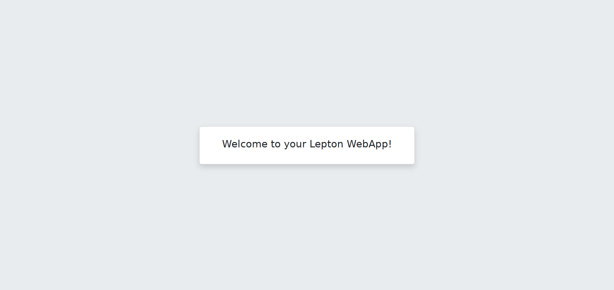

# LEPTON

LEPTON (Lightweight and Efficient PHP Technology for Online Navigation) is a MVC PHP framwework designed to be light & simple to install on shared webhosting.

Thanks for checking it out!

## Installation
To use LEPTON for your next webapp, you can just copy the template project

` composer create-project aisf/lepton-app-basic your-app-name `

Then move into the new folder

`cd your-app-name`

and start LEPTON development webserver

`./lepton.php`

Now you can connect to the shown address (usually http://localhost:555) and you should see LEPTON welcome page.

## Documentation
All documentation is in the Wiki [here](https://github.com/ai-sf/lepton/wiki).

## Suggest features, changes and report issues
Please open an issue
